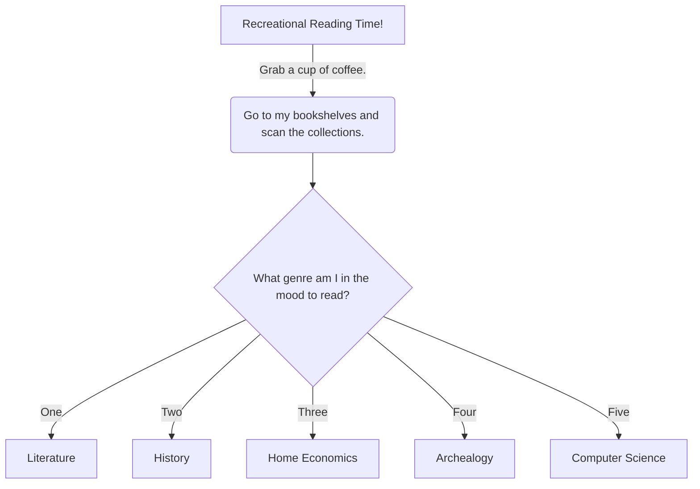

# Recreational Reading Time! Flowchart:
### In my spare time I enjoy _reading_ and _drinking coffee_.   
### My usual process is to start by _getting a coffee_, _scanning_ my bookshelves and _selecting_ a book that interests me based on _genre_.
>Each step of the process must be followed in order.  I need to have my coffee ready first and I cannot decide what I want to read unless I have scanned my collection. The book selection is the final piece so that I can settle in and enjoy a good book and a good cup of coffee.   
